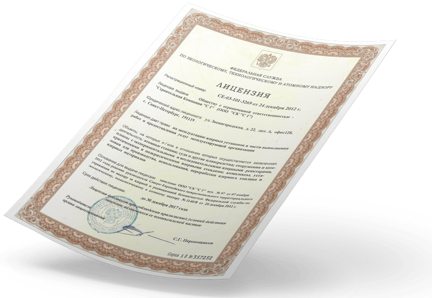
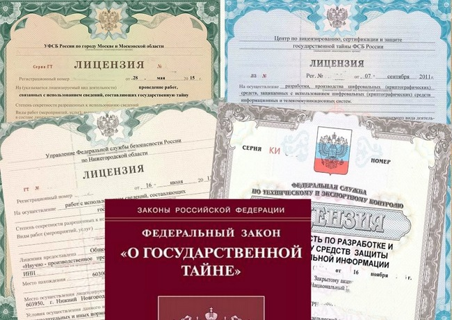

---
## Front matter
lang: ru-RU
title: "Доклад на тему 'Государственная система лицензирования. Система лицензирования в области защиты государственной тайны'"
subtitle: 
author:
  - Маляров Семён Сергеевич
institute:
  - Российский университет дружбы народов им. Патриса Лумумбы, Москва, Россия
date: 09 сентября 2024

babel-lang: russian
babel-otherlangs: english
mainfont: Arial
monofont: Courier New
fontsize: 12pt

## Formatting pdf
toc: false
toc-title: Содержание
slide_level: 2
aspectratio: 169
section-titles: true
theme: metropolis
header-includes:
 - \metroset{progressbar=frametitle,sectionpage=progressbar,numbering=fraction}
 - '\makeatletter'
 - '\beamer@ignorenonframefalse'
 - '\makeatother'
---

# Содержание

1. Введение
2. Лицензирование отдельных видов деятельности. Нормативно-правовая база
3. Лицензирование медицинской деятельности
4. Лицензирование в области защиты государственной тайны
5. Заключение
6. Список литературы

# Докладчик

* Маляров Семён Сергеевич
* студент 4-го курса НПИбд-01-21
* Российский университет дружбы народов им. Патриса Лумумбы
* 1032209505@pfur.ru
* https://github.com/khamovnik

# Цель

Целью данного доклада является раскрытие сущности и значимости ключевых принципов системы лицензирования в России, а также конкретно лицензирования в области защиты государственной тайны.

# Глава 1. Лицензирование отдельных видов деятельности. Нормативно-правовая база

{#fig:001 width=70%}

# Глава 1.1 Лицензирование медицинской деятельности

{#fig:002 width=70%}

# Глава 2. Лицензирование в области защиты государственной тайны

{#fig:003 width=70%}

# Заключение

Государственная система лицензирования является важным элементом упорядочивания деятельности различных учреждений на территории РФ. Регламенты, утвержденные соответствующими Законами, Постановлениями, Положениями, позволяют беспристрастно и объективно оценивать соответствие соискателя лицензии лицензионным требованиям. 

Лицензирование в области защиты государственной тайны является серьезным процессом с точки зрения соблюдением интересов национальной безопасности государства. 

В заключение можно отметить, что  эффективность системы лицензирования  зависит  от  сочетания  правовых  норм,  технологических  решений  и  высокой  ответственности  всех  участников  процесса.

# Список литературы

1. Федеральный закон от 04.05.2011 №99-ФЗ "О лицензировании отдельных видов деятельности" // https://base.garant.ru/12185475/?ysclid=m0vawasoke454426878 (дата обращения: 09.09.2024)

2. Постановление Правительства РФ от 01.06.2021 г. №852  // https://base.garant.ru/400846456/ (дата обращения: 09.09.2024)

3. Закон РФ от 21 июля 1993 г. №5485-I "О государственной тайне" (с изменениями и дополнениями) // https://base.garant.ru/10102673/ (дата обращения: 09.09.2024)

4. Постановление Правительства РФ от 15.04.1995 №333 (ред. от 26.10.2023) // https://www.consultant.ru/document/cons_doc_LAW_6387/ (дата обращения: 09.09.2024)

5. Общая информация по лицензированию // http://clsz.fsb.ru/clsz/license.htm (дата обращения: 09.09.2024)

